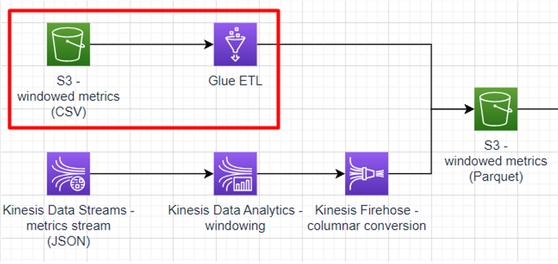
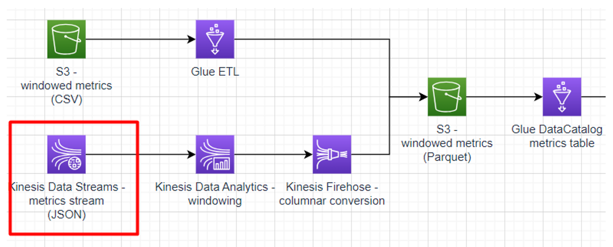

# Solution overview


Key elements
* the overall goal is to build a system for monitoring a set of microservices
  * one “legacy” set of services work somewhere outside the cloud and delivers pre-aggregated stats in batches - _windowed metrics (CSV)_
  * another “modern” set of services reside in the cloud and report in real time - _metrics stream_
  * also, there are server access logs collected in batches - _server access logs (TXT)_
* a lightweight ETL job is required to convert the CSV metrics into Parquet
* a streaming pipeline is required to aggregate, convert, and deliver the realtime metrics to the same Parquet bucket
* a Spark job is required to build daily intra-service traffic reports based on the server access logs
* the traffic reports and aggregated Parquet metrics should be queryable through an SQL interface and visualised using interactive dashboards

# Data model

## Metrics stream

The metrics events coming to the Kinesis stream may be viewed as the following JSON document:
```json
{
 // the component produced the event
 "componentName": "user-service",
 // the name of the metric
 "metricName": "cpu-usage",
 // measurement unit
 "unit": "percent",
 // measurement value
 "value": 32,
 // the event publication time according
 // to the component's local clock
 "publicationTimestamp": "2021-09-09T12:15:02.001Z"
}
```

The same model applies to the S3 metrics Parquet bucket.

## Windowed metrics

The windowed metrics dataset represents an aggregation of the metrics stream in windows of 5-minute length. They can be viewed as the following JSON document:
```json
{
 // the component produced the event
 "componentName": "user-service",
 // the name of the metric
 "metricName": "cpu-usage",
 // measurement unit
 "unit": "percent",
 // measurement values: min and max
 "minValue": 10,
 "maxValue": 23,
 // the time which the window is computed for
 "fromTimestamp": "2021-09-09T12:15:02.001Z",
  "toTimestamp": "2021-09-09T12:15:07.001Z"
}
```
## Server access logs

The server access logs as follows:
```nginx
66.249.65.159 - - [06/Nov/2014:19:10:38 +0600] "GET /user-service/api/user/123 HTTP/1.1" 404 "Mozilla/5.0 (iPhone; CPU iPhone OS 6_0 like Mac OS X) AppleWebKit/536.26 (KHTML, like Gecko) Version/6.0 Mobile/10A5376e Safari/8536.25 (compatible; Googlebot/2.1; +http://www.google.com/bot.html)"

66.249.65.3 - order-service [06/Nov/2014:19:11:24 +0600] "GET /user-service/api/users/234 HTTP/1.1" 200 "Machine (Apache-Http-Client)"

66.249.65.62 - - [06/Nov/2014:19:12:14 +0600] "DELETE /order-service/api/orders/abc HTTP/1.1" 200 "Mozilla/5.0 (compatible; Googlebot/2.1; +http://www.google.com/bot.html)"
```

In fact, the logs correspond to the default (aka combined) Nginx log format:
```nginx
'$remote_addr - $remote_user [$time_local] '
    '"$request" $status "$http_user_agent"'
```

More details on the format may be found [here](https://nginx.org/en/docs/http/ngx_http_log_module.html#access_log) and full description of the fields may be found [here](https://nginx.org/en/docs/http/ngx_http_core_module.html#variables).

**NOTES:**
* The request line (HTTP method + URL) assumes that the URL begins with the name of the service hosting the API being invoked.
* The user agent field may be either
  * `Machine (<HTTP library name>; <service name>)` - where the _service name_ reflects the unique name of the invoking service
  * anything that doesn’t start with _Machine_ refers to calls from external users
## Server traffic report

The server traffic report is recommended to have the following structure if viewed as a JSON document:
```json
{
 // an alphanumeric string, should be unique per service pair
 "id": "asbkhgl2598y3944t",
 // the name of the source (requesting) service
 "source": "user-service",
 // the name of the target (responding) service
 "target": "auth-service",
 // the total number of requests done in 24 hours
 "totalRequests": 1025
}
```

**Note:** The details on why this structure is recommended may be found in the _EMR daily traffic report job_ sub-task.
# Generating test data

## Basic usage

The suggested way of getting test data for the sub-tasks in this module is through the data generator CLI tool found in the attachments. To use the generator, copy it to some directory and execute the following command:
```bash
java -jar test-data-generator-1.0.0-all.jar <path-to-task.json>
```

The _path-to-task.json_ is either an absolute or relative path to a valid JSON file defining the generation task which may be one of the following:
* CSV-formatted metrics
* server access logs
* JSON-formatted Kinesis stream of metrics

The attachments include samples for each of these tasks, but you may write your own if needed as explained below.

The CSV-formatted metrics task has the following properties:
```json
{
 "@type": "windowed-metrics",
 // number of iterations per metric
 "numberOfIterations": 2,
 // the time settings below
 // only affect the content produced,
 // they do not affect how long the generation
 // takes
 "timer": {
   "@type": "synthetic",
   // the timestamp to start emitting from
   "startTime": "2020-09-01T12:35:05.001Z",
   // time increment for every subsequent emission
   "stepMillis": 10000
 },
 // the path (absolute or relative to the current dir)
 // to the folder where to put generated CSVs
 "outputFilePath": "test-output",
 "metrics": {
   // the top level here defines a component
   "user-service": {
     // the nested level defines the metrics
     // provided by the component
     "cpu": {
       "unit": "percent",
       "averageFrom": 10.0,
       "averageTo": 25.0,
       "minDiff": 2.0,
       "maxDiff": 5.0
     },
     "ram": {
       "unit": "percent",
       "averageFrom": 50.0,
       "averageTo": 75.0,
       "minDiff": 12.0,
       "maxDiff": 20.0
     }
   },
   "order-service": {
     "cpu": {
       "unit": "percent",
       "averageFrom": 20.0,
       "averageTo": 30.0,
       "minDiff": 9.0,
       "maxDiff": 15.0
     },
     "ram": {
       "unit": "percent",
       "averageFrom": 10.0,
       "averageTo": 90.0,
       "minDiff": 5.0,
       "maxDiff": 6.0
     }
   }
 }
}

```


The server access logs task has the following properties:
```json
{
 "@type": "server-access-log",
 // list of services
 "services": [
   {
     // service name
     "name": "order-service",
     // list of the endpoints provided by the service
     "endpoints": [
       {
         // URL and method that may be referred by
         // other services or users
         "relativeUrl": "/api/v1/orders",
         "httpMethod": "POST",
         // dependencies invoked by this endpoint
         "dependencies": [
           {
             // name of the dependecy service
             "serviceName": "audit-service",
             // URL and method of the dependency endpoint
             "relativeUrl": "/api/v1/audit",
             "httpMethod": "POST"
           },
           {
             "serviceName": "user-service",
             "relativeUrl": "/api/v1/users/{id}",
             "httpMethod": "GET"
           },
           {
             "serviceName": "payment-service",
             "relativeUrl": "/api/v1/payments/3ds",
             "httpMethod": "POST"
           }
         ]
       },
       {
         "relativeUrl": "/api/v1/orders/{id}",
         "httpMethod": "GET",
         "dependencies": [
           {
             "serviceName": "user-service",
             "relativeUrl": "/api/v1/users/{id}",
             "httpMethod": "GET"
           }
         ]
       }
     ]
   },
   {
     "name": "user-service",
     "endpoints": [
       {
         "relativeUrl": "/api/v1/users/{id}",
         "httpMethod": "GET",
         "dependencies": []
       }
     ]
   },
   {
     "name": "audit-service",
     "endpoints": [
       {
         "relativeUrl": "/api/v1/audit",
         "httpMethod": "POST",
         "dependencies": []
       }
     ]
   },
   {
     "name": "payment-service",
     "endpoints": [
       {
         "relativeUrl": "/api/v1/payments/3ds",
         "httpMethod": "POST",
         "dependencies": [
           {
             "serviceName": "audit-service",
             "relativeUrl": "/api/v1/audit",
             "httpMethod": "POST"
           }
         ]
       }
     ]
   }
 ],
 // simulated calls by simulated users
 "loadItems": [
   {
     "userAgent": "Chrome",
     "userAddress": "192.168.15.15",
     "remoteUser": "129837ejghdfdhg",
     "call": {
       "serviceName": "user-service",
       "relativeUrl": "/api/v1/users/{id}",
       "httpMethod": "GET"
     }
   },
   {
     "userAgent": "Edge",
     "userAddress": "192.168.16.16",
     "remoteUser": "34509dlkjg",
     "call": {
       "serviceName": "order-service",
       "relativeUrl": "/api/v1/orders/{id}",
       "httpMethod": "GET"
     }
   },
   {
     "userAgent": "Firefox",
     "userAddress": "192.168.17.17",
     "remoteUser": ";ldkh045",
     "call": {
       "serviceName": "order-service",
       "relativeUrl": "/api/v1/orders",
       "httpMethod": "POST"
     }
   }
 ],
 // number of iterations per load item
 "numberOfIterations": 9,
 // the range of delays in the inter-service calls
 // due to network latency
 "networkLagMinMillis": 10,
 "networkLagMaxMillis": 1500,
 // the timme settings below
 // only affect the content produced,
 // they do not affect how long the generation
 // takes
 "timer": {
   "@type": "synthetic",
   // the timestamp to start making calls at
   "startTime": "2022-09-15T13:43:01.005Z",
   // the delay between consecutive
   // calls per load item
   "stepMillis": 14400000
 },
 // the path (absolute or relative to the current dir)
 // to the folder where to put generated logs,
 // there will be one file per service-date pair
 "outputDirectoryPath": "test-output"
}
```

The Kinesis stream of metrics task has the following properties:
```json
{
 "@type": "kinesis-metrics-stream",
 // the coordinates of the Kinesis Stream
 // to write to
 "stream": {
   "region": "${aws_region}",
   "streamName": "${aws_kinesis_stream}"
 },
 // the number of iterations per metric
 "iterationsNumber": 2,
 // the timer settings used to
 // control the generation rate,
 // which is done in REALTIME
 "timer": {
   "@type": "realtime",
   "startTime": "2020-01-01T11:32:54.000Z",
   "rateMillis": 1000
 },
 // list of metrics
 "metrics": {
   // the top level defines a component
   // with one or more metrics
   "user-service": {
     // the nested leve defines
     // the metrics themselves
     "cpu": {
       "unit": "percent",
       "minValue": 10.0,
       "maxValue": 25.0
     },
     "ram": {
       "unit": "percent",
       "minValue": 50.0,
       "maxValue": 75.0
     }
   },
   "order-service": {
     "cpu": {
       "unit": "percent",
       "minValue": 20.0,
       "maxValue": 30.0
     },
     "ram": {
       "unit": "percent",
       "minValue": 10.0,
       "maxValue": 90.0
     }
   }
 }
}
```
## Limitations

To safeguard against overuse of AWS resources used in the module, the test data generator imposes some hard-coded limit:
* Kinesis metrics stream - 100 realtime metrics per task run
* CSV metrics - 10 000 metrics per task run
* server access logs - 150 000 log entries (including intra-service calls) per task run

If needed, you may get the source code and adjust it yourself. See the details on this below.
## Building and customising the test generator

You may find the test generator source code [here](materials/test-data-generator/). How to build
* prerequisites
  * JDK 18+ (make sure your default system environments point JAVA_HOME at it, otherwise the integration tests might fail)
  * Docker
* steps
  * execute `./gradlew build` - this will include compilation, unit tests, and integration tests
  * execute `./gradlew deploy -DdeploymentPath=<path>` - this will copy the all-in-one JAR and sample task JSONs to the _path_ specified
	* the `-DdeploymentPath` is optional - by default the deployment will happen in _test-data-generator/build/deployment_
	* when running on Windows, make sure to prepend your deployment path with “\” if using an absolute path
# Sub-task 1 - ingesting with Glue ETL


**Goal:**
* write a Python script to transform windowed metric documents from CSV files to Parquet files
* run the script using Glue ETL
* optional - write another Glue ETL job to ingest plain metrics documents from CSV and calculating windows on them

**Instructions:**
* create an S3 bucket for storing the windowed metrics in the CSV format
* create an S3 bucket for storing the windowed metrics in the Parquet format
* use the CSV metrics task provided by the test data generator and copy the resulting files to the CSV bucket
* follow [this guide](https://docs.aws.amazon.com/prescriptive-guidance/latest/patterns/three-aws-glue-etl-job-types-for-converting-data-to-apache-parquet.html) and **pay attention to the points below**
  * use the CSV bucket as the _input_loc_ parameter
  * use the Parquet bucket as the _output_loc_ parameter
  * make sure to choose the **Python shell** job type and **0.0625 DPU** of compute

**Cost management recommendations:**
* make sure the ETL job is shut down

**Optional instructions:**
* create another S3 bucket for storing plain (non-windowed) metrics events
* use the CSV metrics task provided by the test data generator and copy the resulting files to the bucket
* create a Python shell Glue job similar to the CSV-Parquet converter above
* customise the new job code
  * aggregate the metrics into 5-minute windows
  * calculate min/max/average metrics values per window
  * write the resulting windows to theS3 Parquet bucket already used for the basic job version
* windowing operations provided by the Pandas library may be used
  * [window indexing](https://pandas.pydata.org/docs/user_guide/window.html#custom-window-rolling)
  * [rolling windows](https://pandas.pydata.org/docs/user_guide/window.html#rolling-apply)
# Sub-task 2 - querying with Glue DataCatalog and Athena


**Goal:**
* create a DataCatalog table for the windowed metrics dataset
* query the table using Athena

**Instructions:**
* create a Data Catalog database - this one will be used not only for this sub-task, so name it properly
* recap the _Windowed metrics_ model
* [manually create a Data Catalog table](https://docs.aws.amazon.com/glue/latest/dg/console-tables.html)
  * choose the _Parquet_ format
  * associate the table with the previously created database
  * point the table to the S3 windowed metrics (Parquet) bucket created in sub-task 1
  * partition by the _metricName_ and _componentName_ columns
  * add columns according to the model
* open Athena in the AWS Console and locate the Data Catalog database created above
* experiment and make some SQL queries to the Metrics table

**Cost management recommendations:**
* in case you tested the ETL job in conjunction with Athena, make sure the job is shut down
# Sub-task 3 - visualising with Grafana


**Goal:**
* familiarise with Grafana
* visualise an Athena datasource

**Instructions:**
* run Grafana instance locally [using Docker](https://grafana.com/docs/grafana/latest/setup-grafana/installation/docker/)
* configure the [Grafana Athena plugin](https://grafana.com/grafana/plugins/grafana-athena-datasource/) with credentials to access the Athena/Glue database created in sub-task 2
* create a Grafana dashboard which allows choosing a specific metric and component and showing a chart with average values for the metric over time

**Cost management recommendations:**
* in case you tested the ETL job in conjunction with Athena/Grafana, make sure the job is shut down
# Sub-task 4 - streaming with Kinesis Data Streams



**Goal:**
* ingest data with Kinesis Data Streams

**Instructions:**
* create a CloudFormation template with a [Kinesis Data Streams resource](https://docs.aws.amazon.com/AWSCloudFormation/latest/UserGuide/aws-resource-kinesis-stream.html)
  * specify the _provisioned_ mode
  * specify 1 shard
* run the template and make sure a stream is created
* generate metrics
  * make sure to authorise to your AWS account via AWS CLI
  * run the Kinesis metrics stream task provided by the test data generator - make sure to specify the correct AWS region and Kinesis stream name in the task config
* make sure the events are visible via the [AWS Console](https://docs.aws.amazon.com/streams/latest/dev/data-viewer.html)
* **important** - to control costs, make sure to dispose the CloudFormation template upon completing the task

**Cost management recommendations:**
* make sure to dispose the Kinesis Stream created with the CloudFormation template - **Kinesis Stream is the most expensive component in the overall solution**
# Sub-task 5 - analysing with Kinesis Data Analytics


**Goal:**
* write an Apache Flink application for computing windows on metrics events
* deploy the Apache Flink application to Kinesis Data Analytics
* connect the Apache Flink application to a Kinesis stream

**Instructions:**
* get to know or recap Apache Flink basics
  * [overview](https://nightlies.apache.org/flink/flink-docs-release-1.14/docs/dev/datastream/overview/)
  * [execution mode](https://nightlies.apache.org/flink/flink-docs-release-1.14/docs/dev/datastream/execution_mode/) - focus on streaming
  * [event time](https://nightlies.apache.org/flink/flink-docs-release-1.14/docs/concepts/time/)
  * [event time - custom watermarks](https://nightlies.apache.org/flink/flink-docs-release-1.14/docs/dev/datastream/event-time/generating_watermarks/)
* create an Apache Flink application that
  * reads events from a stream of events that correspond to the _Metrics stream_ model
  * applies [tumbling or sliding windows](https://nightlies.apache.org/flink/flink-docs-release-1.14/docs/dev/datastream/operators/windows/#tumbling-windows) to the stream - 5 minutes per window based on the event publication timestamp
  * reduces each window into an aggregate event that corresponds to the _Windowed metrics_ model
* write some [unit tests](https://nightlies.apache.org/flink/flink-docs-release-1.14/docs/dev/datastream/testing/) for the application
* create a temporary S3 bucket for storing JSON files
* deploy the application to Kinesis Data Analytics
  * extend the CloudFormation template created in sub-task 4
  * update your code to work with
	  * [Kinesis Data Streams as a source](https://docs.aws.amazon.com/kinesisanalytics/latest/java/how-sources.html#input-streams)
	  * [S3 bucket as a sink](https://docs.aws.amazon.com/kinesisanalytics/latest/java/how-sinks.html#sinks-s3)
  * [create an Data Analytics application](https://docs.aws.amazon.com/kinesisanalytics/latest/java/how-creating-apps.html) based on your code
  * connect the application to the stream created in sub-task 4 and to the temporary JSON bucket
* run your application and make sure correct JSON files appear in the temporary bucket
* remove the temporary JSON bucket

**Cost management recommendations:**
* make sure to dispose the resources create using CloudFormation - **Kinesis Stream is the most expensive component in the overall solution**
# Sub-task 6 - delivering with Kinesis Data Firehose


**Goal:**
* setup a JSON-to-Parquet transformation
* write a Kinesis stream into a Parquet S3 bucket

**Instructions**:
* update the CloudFormation template created in sub-tasks 4-5
  * create a Kinesis Data Firehose delivery stream
  * configure the delivery stream to write to the windowed metrics S3 bucket
  * set up a [JSON-to-Parquet conversion](https://docs.aws.amazon.com/firehose/latest/dev/record-format-conversion.html)
  * point the Flink application created in sub-task 5 to write to the new delivery stream
* ingest some events to the Kinesis Data Stream and use Athena to make sure the data appears in the destination bucket

**Cost management recommendations:**
* make sure to dispose the resources create using CloudFormation - **Kinesis Stream is the most expensive component in the overall solution**
# Sub-task 7 - reporting with EMR


**Goal:**
* write a Spark batch job to parse server access logs and build a call graph based on them
* visualise the reports using Grafana graphs
* optional - enrich the call graph reports with the metrics data derived from the previously ingested stream

**Instructions:**
* create an S3 traffic report bucket
* create a Glue Data Table for the bucket
  * follow the _Server traffic report_ model
* write a Spark batch job that
  * reads a dataset from the S3 server access logs bucket
  * filters data for only the specified time range (latest 24 hours by default)
  * parses them (see the _Server access logs_ model)
  * calculates the number of calls per service pair (see the _Server traffic report_ model)
  * writes the reports in the JSON format into the S3 traffic report bucket
* cover the job with unit tests
* deploy the job using EMR in Serverless mode
* use the server access log task provided by the test data generator and copy the resulting files to the S3 server access logs bucket
* run the job, and make sure correct reports appear in the S3 traffic report bucket
* configure a graph dashboard in Grafana
  * follow the conventions from the [node graph panel documentation](https://grafana.com/docs/grafana/latest/panels-visualizations/visualizations/node-graph/)
  * check how to [use SQL-like data sources for graph visualisations](https://community.grafana.com/t/nodegraph-with-mysql/66338/3)
  * use an Athena datasource pointed at the S3 traffic report bucket as the _edges_ Grafana data frame

**Cost management recommendations:**
* make sure the EMR job is shut down