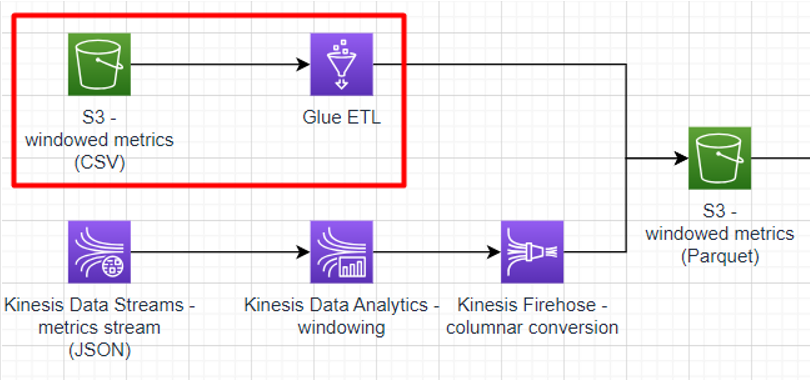

# Sub-task 1 - ingesting with Glue ETL

**Learning prerequisites:**
* [Data engineering with AWS](https://learn.epam.com/detailsPage?id=b478ad0c-a4cc-4d27-a093-1d4661bfc19e) - **sections 1-2** (EPAM Learn course, it will be assigned to you by the organizers)
* [AWS Glue Getting Started](https://explore.skillbuilder.aws/learn/course/internal/view/elearning/8171/getting-started-with-aws-glue) (AWS Skill Builder)

**Goal:**
* write a Python script to transform windowed metric documents from CSV files to Parquet files
* run the script using Glue ETL
* optional - write another Glue ETL job to ingest plain metrics documents from CSV and calculating windows on them

**Instructions:**
* create an S3 bucket for storing the windowed metrics in the CSV format
* create an S3 bucket for storing the windowed metrics in the Parquet format
* use the CSV metrics task provided by the test data generator and copy the resulting files to the CSV bucket
* follow [this guide](https://docs.aws.amazon.com/prescriptive-guidance/latest/patterns/three-aws-glue-etl-job-types-for-converting-data-to-apache-parquet.html) and **pay attention to the points below**
    * use the CSV bucket as the _input_loc_ parameter
    * use the Parquet bucket as the _output_loc_ parameter
    * make sure to choose the **Python shell** job type and **0.0625 DPU** of compute

**Cost management recommendations:**
* make sure the ETL job is shut down

**Optional instructions:**
* create another S3 bucket for storing plain (non-windowed) metrics events
* use the CSV metrics task provided by the test data generator and copy the resulting files to the bucket
* create a Python shell Glue job similar to the CSV-Parquet converter above
* customise the new job code
    * aggregate the metrics into 5-minute windows
    * calculate min/max/average metrics values per window
    * write the resulting windows to theS3 Parquet bucket already used for the basic job version
* windowing operations provided by the Pandas library may be used
    * [window indexing](https://pandas.pydata.org/docs/user_guide/window.html#custom-window-rolling)
    * [rolling windows](https://pandas.pydata.org/docs/user_guide/window.html#rolling-apply)