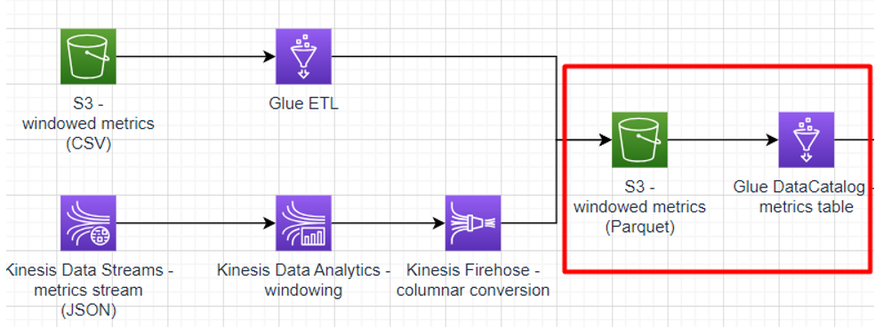

# Sub-task 2 - querying with Glue DataCatalog and Athena



**Goal:**
* create a DataCatalog table for the windowed metrics dataset
* query the table using Athena

**Instructions:**
* create a Data Catalog database - this one will be used not only for this sub-task, so name it properly
* recap the _Windowed metrics_ model
* [manually create a Data Catalog table](https://docs.aws.amazon.com/glue/latest/dg/console-tables.html)
    * choose the _Parquet_ format
    * associate the table with the previously created database
    * point the table to the S3 windowed metrics (Parquet) bucket created in sub-task 1
    * partition by the _componentName_ column
    * add columns according to the model
      * min/maxValue - double
      * to/fromTimestamp - string
      * everything else - string
    * **schema pitfalls**
      * make sure to add the columns in the order exactly as in the header of the CSVs generated in sub-task 1
      * before confirming the table creation, make sure the `componentName` column is at position 1 - manually adjust, if Glue Catalog tries pushing it at the end
* set up Athena
  * create another S3 bucket 
  * open Athena query editor and configure the bucket as an output location in Settings
  * before running any read queries, add one partition per unique `componentName` in the data generated in sub-task 1, for example
```sql
ALTER TABLE `<your table name>`
    ADD PARTITION (componentname = 'order-service') LOCATION 's3://ybaranouski-dt4j-metrics-table/order-service/'
    ADD PARTITION (componentname = 'user-service') LOCATION 's3://ybaranouski-dt4j-metrics-table/user-service/';
```
* experiment and make some SQL queries to the Metrics table
* **querying pitfalls**
  * DDL queries like `ADD PARTITION` above require table names to be enclosed into back-ticks (see the query example above)
  * in the `SELECT` queries though, table names and other identifiers are double-quoted like this `"metrics-table"`

**Cost management recommendations:**
* in case you tested the ETL job in conjunction with Athena, make sure the job is shut down