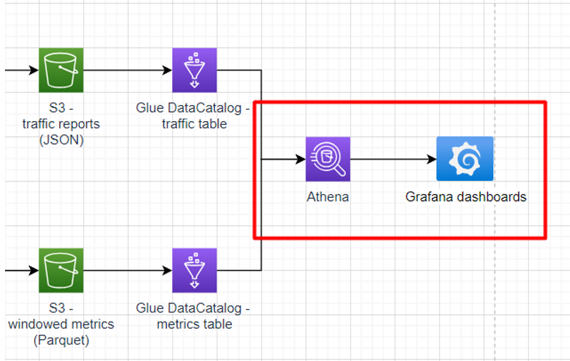

# Sub-task 3 - visualising with Grafana

**Learning prerequisites:**
* [Grafana overview](https://www.youtube.com/watch?v=w-c3KYKQQfs&ab_channel=edureka%21) (video)
* [Running Grafana in Docker](https://grafana.com/docs/grafana/latest/setup-grafana/installation/docker/) (official docs)
* [Athena Plugin for Grafana](https://grafana.com/grafana/plugins/grafana-athena-datasource/?tab=installation) (official docs)

**Goal:**
* familiarise with Grafana
* visualise an Athena datasource

**Instructions:**
* run Grafana instance locally [using Docker](https://grafana.com/docs/grafana/latest/setup-grafana/installation/docker/)
* to simplify things (especially if you use an EPAM AWS Sandbox), use the Grafana setup from `materials/aws-local-stack` (see the README there)
* configure the [Grafana Athena plugin](https://grafana.com/grafana/plugins/grafana-athena-datasource/) with credentials to access the Athena/Glue database created in sub-task 2
* create a Grafana dashboard which allows choosing a specific metric and component and showing a chart with average values for the metric over time

**Cost management recommendations:**
* in case you tested the ETL job in conjunction with Athena/Grafana, make sure the job is shut down