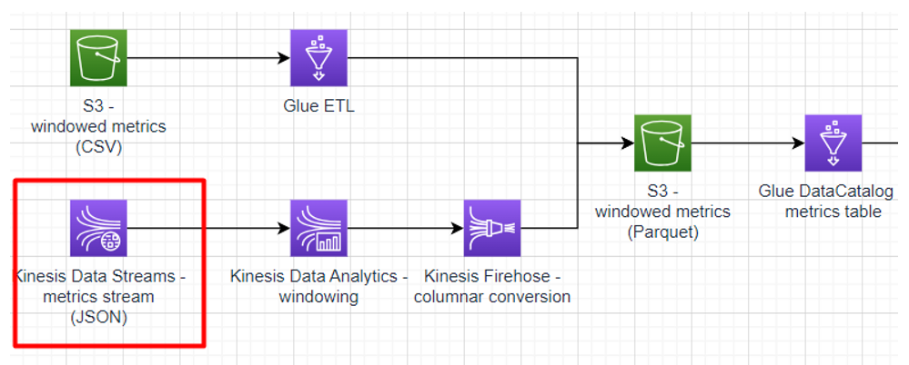

# Sub-task 4 - streaming with Kinesis Data Streams

**Learning prerequisites:**
* [AWS for Developers: Data-Driven Serverless Applications with Kinesis](https://learn.epam.com/detailsPage?id=3d2f05f1-49a6-412a-83c4-def85e9e5ce2) - **section 2** (EPAM Learn course, it will be assigned to you by the organizers)

**Goal:**
* ingest data with Kinesis Data Streams

**Instructions:**
* create a CloudFormation template with a [Kinesis Data Streams resource](https://docs.aws.amazon.com/AWSCloudFormation/latest/UserGuide/aws-resource-kinesis-stream.html)
    * specify the _provisioned_ mode
    * specify 1 shard
* run the template and make sure a stream is created
* generate metrics
    * make sure to authorise to your AWS account via AWS CLI
    * run the Kinesis metrics stream task provided by the test data generator - make sure to specify the correct AWS region and Kinesis stream name in the task config
* make sure the events are visible via the [AWS Console](https://docs.aws.amazon.com/streams/latest/dev/data-viewer.html)
* **important** - to control costs, make sure to dispose the CloudFormation template upon completing the task

**Cost management recommendations:**
* make sure to dispose the Kinesis Stream created with the CloudFormation template - **Kinesis Stream is the most expensive component in the overall solution**