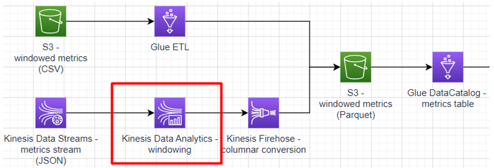

# Sub-task 5 - analysing with Kinesis Data Analytics

# Learning prerequisites
* [Real-time streaming with Apache Flink, part 1](https://explore.skillbuilder.aws/learn/course/internal/view/elearning/16031/aws-partnercast-session-1-real-time-streaming-with-apache-flink-advanced-technical-advanced-level-300-technical) (AWS Skill Builder)
* [Real-time streaming with Apache Flink, part 2](https://explore.skillbuilder.aws/learn/course/internal/view/elearning/16036/aws-partnercast-session-2-real-time-streaming-with-apache-flink-technical-advanced-level-300-technical) (AWS Skill Builder)

# Goal
* write an Apache Flink application for computing windows on metrics events
* deploy the Apache Flink application to Kinesis Data Analytics
* connect the Apache Flink application to a Kinesis stream

# Instructions

## Step 1 - learn about Apache Flink
* get to know or recap Apache Flink basics
    * [overview](https://nightlies.apache.org/flink/flink-docs-release-1.14/docs/dev/datastream/overview/)
    * [execution mode](https://nightlies.apache.org/flink/flink-docs-release-1.14/docs/dev/datastream/execution_mode/) - focus on streaming
    * [event time](https://nightlies.apache.org/flink/flink-docs-release-1.14/docs/concepts/time/)
    * [event time - custom watermarks](https://nightlies.apache.org/flink/flink-docs-release-1.14/docs/dev/datastream/event-time/generating_watermarks/)

## Step 2 - create a streaming application
* create an Apache Flink application that
    * reads events from a stream of events that correspond to the _Metrics stream_ model
    * applies [tumbling or sliding windows](https://nightlies.apache.org/flink/flink-docs-release-1.14/docs/dev/datastream/operators/windows/#tumbling-windows) to the stream - 5 minutes per window based on the event publication timestamp
    * reduces each window into an aggregate event that corresponds to the _Windowed metrics_ model
    * prints the resulting aggregate windows to `stdout`
* **implementation recommendations**
  * make sure to configure a **timestamp assigner**
  * make sure to configure a proper **watermark strategy with source idleness timeout**
  * follow the [Flink test template](../materials/flink-test-template/README.MD)
    * this template project will help you to set up a baseline for the dependencies required to package a Flink application for AWS deployment using an Uber (shaded) JAR
    * also, it contains a convenient template for running Flink integration tests locally against LocalStack's Kinesis implementation
    * in case you're more inclined towards Maven, you may still reuse the integration test template and look up a POM example [here](https://github.com/aws-samples/amazon-managed-service-for-apache-flink-examples/blob/main/java/KinesisConnectors/pom.xml)

## Step 3 - test the streaming application
* write some [unit tests](https://nightlies.apache.org/flink/flink-docs-release-1.14/docs/dev/datastream/testing/) for the application

## Step 4 - deploy the streaming application
* deploy the application to Kinesis Data Analytics
    * extend the CloudFormation template created in sub-task 4
    * update your code to work with
        * [Kinesis Data Streams as a source](https://docs.aws.amazon.com/kinesisanalytics/latest/java/how-sources.html#input-streams)
    * [create a Data Analytics application](https://docs.aws.amazon.com/kinesisanalytics/latest/java/how-creating-apps.html) based on your code
    * connect the application to the stream created in sub-task 4
* run your application and make sure the application logs contain aggregate metrics

# Cost management recommendations
* make sure to dispose the resources create using CloudFormation - **Kinesis Stream is the most expensive component in the overall solution**

# Checklist for the final exam

The checklist for this task is part of the demo expected for **task 6**.