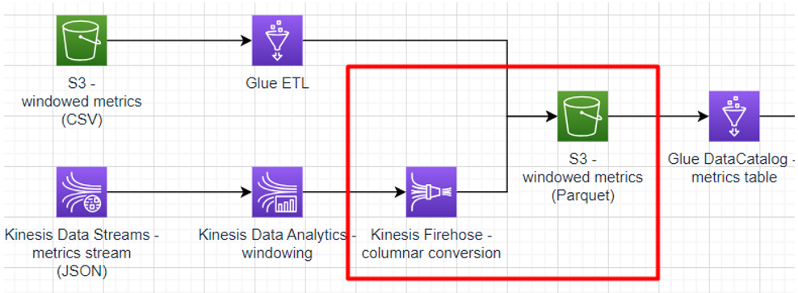

# Sub-task 6 - delivering with Kinesis Data Firehose

**Goal:**
* setup a JSON-to-Parquet transformation
* write a Kinesis stream into a Parquet S3 bucket

**Instructions**:
* update the CloudFormation template created in sub-tasks 4-5
    * create a Kinesis Data Firehose delivery stream
    * configure the delivery stream to write to the windowed metrics S3 bucket
    * set up a [JSON-to-Parquet conversion](https://docs.aws.amazon.com/firehose/latest/dev/record-format-conversion.html)
    * point the Flink application created in sub-task 5 to write to the new delivery stream
* ingest some events to the Kinesis Data Stream and use Athena to make sure the data appears in the destination bucket

**Cost management recommendations:**
* make sure to dispose the resources create using CloudFormation - **Kinesis Stream is the most expensive component in the overall solution**