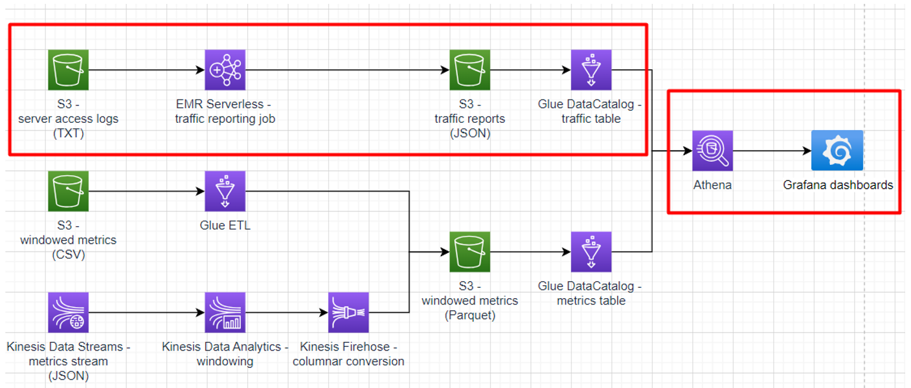

# Sub-task 7 - reporting with EMR



**Learning prerequisites:**
* [Getting started with Amazon EMR](https://explore.skillbuilder.aws/learn/course/internal/view/elearning/8827/getting-started-with-amazon-emr) (AWS Skill Builder)

**Goal:**
* write a Spark batch job to parse server access logs and build a call graph based on them
* visualise the reports using Grafana graphs
* optional - enrich the call graph reports with the metrics data derived from the previously ingested stream

**Instructions:**
* create an S3 traffic report bucket
* create a Glue Data Table for the bucket
    * follow the _Server traffic report_ model
* write a Spark batch job that
    * reads a dataset from the S3 server access logs bucket
    * filters data for only the specified time range (latest 24 hours by default)
    * parses them (see the _Server access logs_ model)
    * calculates the number of calls per service pair (see the _Server traffic report_ model)
    * writes the reports in the JSON format into the S3 traffic report bucket
* cover the job with unit tests
* deploy the job using EMR
  * create an IAM role which grants access to the input and output buckets
  * create an EMR Studio (it's free to keep)
  * create an EMR Serverless application, but **pay attention to**
    * disable pre-initialized capacity
    * set capacity limits to 3 vCPUs, 4096 Mb of RAM, 60 Gb of disk
    * make sure interactive endpoint is disabled
  * upload your Spark code archive to some S3 bucket
* use the server access log task provided by the test data generator and copy the resulting files to the S3 server access logs bucket
* run the job
  * in the serverless app just created above, submit a job
  * use the following parameters
    * choose the IAM role created above
    * browse to your Spark code archive in S3
    * set the following Spark properties (edit as text):
```
--conf spark.executor.cores=1 --conf spark.executor.memory=1g --conf spark.driver.cores=1 --conf spark.driver.memory=1g --conf spark.executor.instances=1
```
  * wait for the job to start (may take 2-3 minutes for the first time if there is no capacity running at the moment for your app)
  * make sure correct reports appear in the S3 traffic report bucket
  * in case of issues, check "View logs" in the job run
    * stderr for Spark driver logs
    * stdout for logs from your code
    * click "Clone" button to rerun the failed job
  * configure a graph dashboard in Grafana
      * follow the conventions from the [node graph panel documentation](https://grafana.com/docs/grafana/latest/panels-visualizations/visualizations/node-graph/)
      * check how to [use SQL-like data sources for graph visualisations](https://community.grafana.com/t/nodegraph-with-mysql/66338/3)
      * use an Athena datasource pointed at the S3 traffic report bucket as the _edges_ Grafana data frame

**Cost management recommendations:**
* make sure the EMR job is shut down
* delete the EMR Serverless application
* EMR Studio may be left intact - it's free