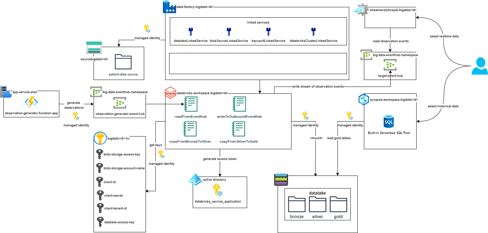

# Task 1 - Infrastructure Setup
> **Time to complete**: 1 hour
## Objective 
The goal of this task is to prepare Azure infrastrcructure to complete following lessons. You will be provided with Terraform scripts that will setup all required components. In scope of this project you will be doing coding tasks mostly on top of already created component just to avoid tedious and error-prone configuration part.
## Prerequisites
 1. Azure personal account or [free trial](https://azure.microsoft.com/en-us/free) if available.
 2. [Terraform](https://www.terraform.io/) is installed locally on your machine.
 3. Java (at least version 17) is installed locally on your machine.
 4. [Maven](https://maven.apache.org/download.cgi) is installed locally on your machine.
> It's required to be connected to VPN once you are working from Belarus.
 1. [Azure CLI](https://learn.microsoft.com/en-us/cli/azure/install-azure-cli) installed locally on your machine.
 2. If you are in Belarussian location, you might experience issue accessing terraform, hence VPN is required. 
## Steps
 1. Compile and Build Azure Function to be used locally in the application.
   - Naviage to */materials/function* folder.
   - Execute `mvn install` command.
   - Make sure that */materials/function/target/* folder contains compiled and built **function-1.0-SNAPSHOT.jar** file.
 2. Install environment.
  - Navigate to */terraform/azure* and open *terraform.tvars* file.
  - Navigate to */terraform/azure* folder and execute following command: `terraform init`. 
  - Run `terraform plan` to review resources that are to be installed in your Azure subscription.
  - In the same directory execute command: `terraform apply`. Print `yes` once requested.
  - Installation might take some time, upon completion you will be provided with several endpoints, these are pathes to studios you will be working from. They will look like:
> databricks_studio_url = "https://adb-123456789.19.azuredatabricks.net"

> datafactory_studio_url = "https://adf.azure.com/en/home"
 
> synapse_studio_url = "https://web.azuresynapse.net?workspace=%2fsubscriptions%2f4d45zb6a-1310-f0g1-90c2-d82d4d3cbc5f%2fresourceGroups%2fbigdataaaec111lzix_rg%2fproviders%2fMicrosoft.Synapse%2fworkspaces%2fsynapse-workspace-bigdataaaec111lzix"

 1. After completion you will have core components being installed within your subscription. The picture below depicts main services. 

## Validation
 1. Go to your Azure Subscription and validate that following components were successfully deployed:
- Storage Account with *patient-data-source* folder inside
- Datalake storage with *bronze*, *silver* and *gold* folders inside.
- Azure Function that generates observation event. To check that events are being generated you might go to Event Hub and validate the *metrics/incoming messages*.
- Data Factory workspace with all required LinkedServices (storage account, datalake, key vault, databricks).
- Databricks workspace with default cluster being installed.  The cluster is of following shape:
> Single Node
> Standard_F4 shape
> 8 GB memory, 4 vCores
> 12.2.x-scala2.12 Runtime
> Automatic shutdown after 15 min inactivity
- Default notebooks with steps to complete will be uploaded to your Databricks workspace.
- Synapse Studio with default built-in Serverless SQL Pool.
- Stream Analytics Job.
