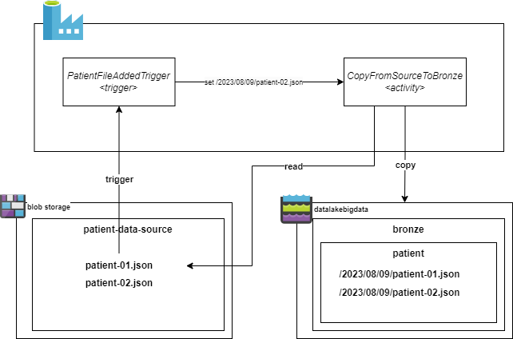

# Task 2 - Batching: copy from source to Bronze (landing) zone.
> **Time to complete**: 1 hour
## Objective 
This is the first step in the batching process. The goal of the task is to copy data from external storage to our landing zone. The file is copied as is without any modifications. We will be using Azure Data Factory Copy Activity to copy the file.

## Steps
1. Navigate to `Data Factory` workspace, login to your git repo as soon as you are prompted.
2. Create new trigger. The trigger is required to initiate a pipeline upon new file creation in the `patient-data-source` folder.
- Type: *Storage events*
- Storage account name: *<your source storage account>* (hint: it starts from `sourcebigdata` )
- Container name:  */patient-data-source/*
- Event: *Blob created*
3. Go to `Author/Pipelines` and create a new pipeline in a way:
- Name: *PatientDataIngestion*
- Parameters with empty default values: 
	- Name: *trigger_file_name*  Type: *String*
	- Name: *destination*  Type: *String*
4. Click on `Add trigger > New/Edit` and select the trigger created on step 2. 
   During the creation, specify the following values for parameters:
 - Parameter *trigger_file_name* set to ```@trigger().outputs.body.fileName```
 - Parameter *destination* set to ```@concat('bronze/patient', '/', formatDateTime(utcnow(), 'yyyy'), '/',formatDateTime(utcnow(),'MM'),'/',formatDateTime(utcnow(),'dd'), '/', trigger().outputs.body.fileName)```

5. To access the source data, we need to create a pipeline dataset and connect it to the linked service  - storage account starts from `sourcebigdata` prefix.
- Go to `Datasets > New dataset`
- From available data stores select `Azure Blob Storage`.
- As a format select `json`.
- Set properties:
  - Name:  `patient_data_source_json_file`
  - Linked service:  `blobSourceBlobStorageLinkedService`
  - Configure `File path`:
      - Container: `patient-data-source`
      - Directory: 
      - File name: `@dataset().trigger_file_name`
  - Import schema option: `None`
- Go to Dataset parameters and create a new one with empty default value:
    - Name: *trigger_file_name*  Type: *String*

6. Create another dataset to be able to access `datalake\bronze` (landing) layer - storage account starts from `datalakebigdata` prefix.
- Go to `Datasets > New dataset`
- From available data stores select `Azure Data Lake Storage Gen2`.
- As a format select `json`.
- Set properties:
    - Name: `datalake_json_file`
    - Linked service:  `blobSourceBlobStorageLinkedService`
    - Configure `File path`:
        - Container: `datalake`
        - Directory:
        - File name: `@dataset().destination`
    - Import schema option: `None`
- Go to Dataset parameters and create a new one with empty default value:
    - Name: *destination*  Type: *String*

7. Add `Copy data` activity to the pipeline.
    - Source: `patient_data_spurce_json_file` (Dataset created on step 5)
      - trigger_file_name:  `@pipeline().parameters.trigger_file_name`
    - Sink: `datalake_json_file` (Dataset created on step 6)
      - destination:  `@pipeline().parameters.destination`

8. Click on `Validate`, then `Publish all`

## Validation
1. Upload one of the patient sample files to `sourcebigdata<id>/patient-data-source/` folder.
2. Go to `Data Factory/Monitor/Pipeline Runs* and make sure that pipeline is completed successfully.
3. Go to `datalakebigdata<id>/datalake/bronze/patient/year/month/day` folder and make sure that file is copied successfully.
