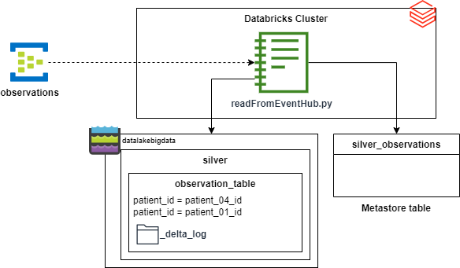
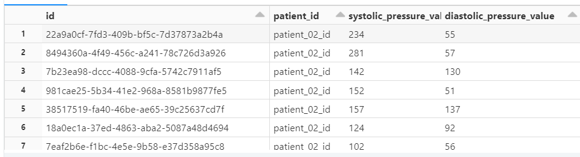

# Task 4 - Streaming: from Source to Silver.
> **Time to complete**: 3 hour
## Objective 
The goal of the task is to continuosly stream data from Azure Even Hub, transform it and store into Silver (refined) layer.

## Steps
1. Go to databricks cluster and open *readFromEvenHub.py* notebook.
2. Complete all steps defined in this notebook.
## Validation
1. Check if data is successfully streamed from EventHub and stored in data lake.

2. From within databricks notebook execute following command:
> select id, patient_id, systolic_pressure_value, diastolic_pressure_value from silver_observations
3. Verify if result resembles something like this

 
## Cleanup
1. Do not forget to **stop the job manually**, as long as it's streaming one it will keep running without not being killed explicitly.
