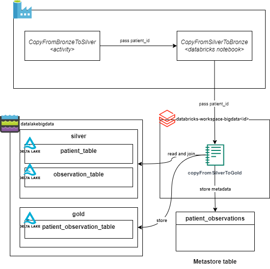

= Task 5 - Batching: copy from Silver to Gold (consumption) layer.
Dzmitry Marudau <dzmitry_marudau@epam.com>
1.0, November 10, 2024: Initial version from README.md
:toc:
:toclevels: 4
:icons: font
:url-quickref: https://docs.asciidoctor.org/asciidoc/latest/syntax-quick-reference/

> > *Time to complete*: 2 hours

== Objective
Tables in Gold layer represent data that has been transformed into knowledge, rather than just information. In our case we need to aggregate Patient and Observation data to provide valuable insights on patient conditions. For this task it's required to join both tables from Silver layer, find average blood pressure for the patient and store as new table in Gold layer.

== Steps
. Go to Azure Data Factory Studio.

. Create new `CopyFromSilverToGold` Databricks Notebook activity.
* Select *copyFromSilverToGold.py* notebook as a source.
* Go to `Settings > Base parameters` and add following one:
** patient_id = @string(activity(**'name of the copy from bronze to silver activity'**).output.runOutput)

. Connect with arrow previous activity with newly created using Data Factory UI.

. Save and publish changes.

. Go to Databricks cluster and open `copyFromSilverToBronze.py`  notebook.

. Complete all steps defined in this notebook.

== Validation
include::../validation/task5-checklist.adoc[]

