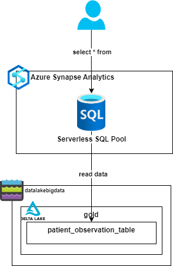

= Task 8 — Consumption. Read Patient Gold Data.
Dzmitry Marudau <dzmitry_marudau@epam.com>
1.0, November 10, 2024: Initial version from README.md
:toc:
:toclevels: 4
:icons: font
:url-quickref: https://docs.asciidoctor.org/asciidoc/latest/syntax-quick-reference/

> > *Time to complete*: 1 hour1

== Objective
As soons as data ends up in Gold layer it's ready to power analytics, machine learning and production application. It contains not just information but also knowledge. Lakehouse architecture allows to query data directly from Delta lake, however sometimes it might not provide desired performance. In this case data is ingested to warehouse platform and fetched from that layer. For our reference architecture we will rely on Azure Synapse Serverless SQL Pool.
[IMPORTANT]
====
Serverless SQL Pool is used as the cheapest and simple option for our case. However for better and predictable performance it's recommended to go with Dedicated SQL Pool.
====

== Steps
. Go to `Databricks` cluster and open `readFromEvenHub.py` notebook.

. Complete all steps defined in this notebook.

== Validation
include::../validation/task8-checklist.adoc[]

