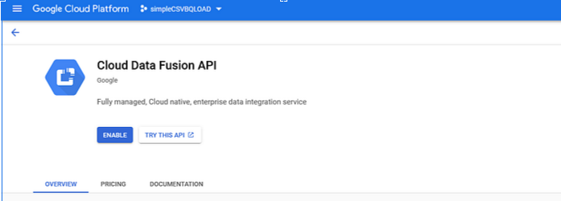
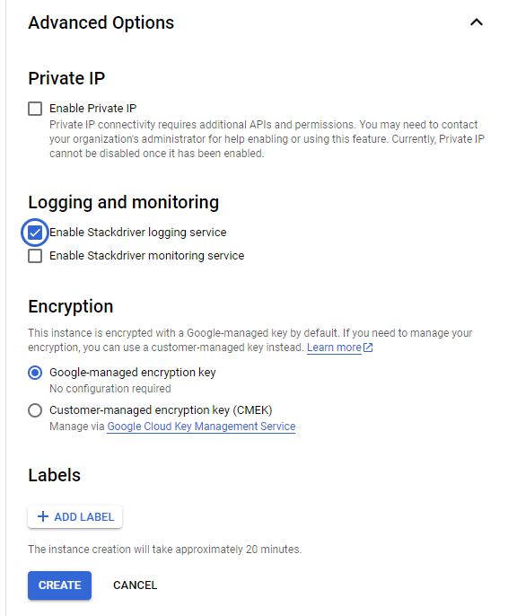
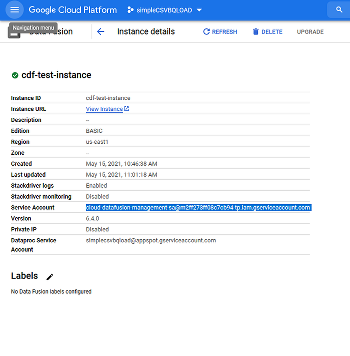
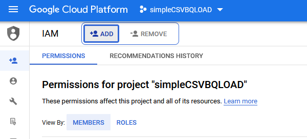
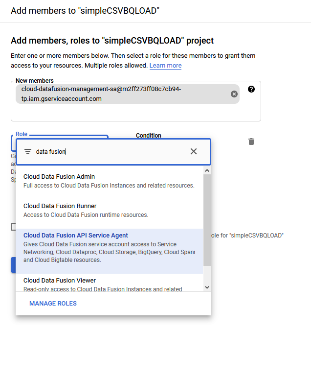

### **Task 3: Create the Data Fusion Instance**

#### **Theory: Data Fusion**

> ***Duration \[2h\]***
>
> [[Cloud Data Fusion
> overview]{.underline}](https://cloud.google.com/data-fusion/docs/concepts/overview)

#### **Practice: Create the Data Fusion instance**

> ***Duration \[1h\]***

Enable the Cloud Data Fusion API if you haven't done so already:

Once the API is enabled, navigate to Data Fusion in the left menu and
click on CREATE AN INSTANCE:

Name your instance with any name you like, I named it
**cdf-test-instance**.

Data Fusion leverages Cloud Dataproc as its underlying big data
processing engine, this means that when a data pipeline is executed,
Data Fusion spawns an ephemeral Dataproc cluster to perform the data
processing for you and submits the pipeline processing to the Dataproc
cluster as a spark job, once the execution of the job is finished, Data
Fusion deletes the Dataproc cluster for you. Make sure to grant the
service account that Data Fusion uses, the proper permissions to spawn
Cloud Dataproc Clusters, it will prompt you to authorize it, when it
does, click the GRANT PERMISSION button **(also keep in mind the region
in which the Data Fusion instance is deployed, needs to match the region
in which the BigQuery dataset was created)**:

Click on the CREATE button, the instance creation will take a few
minutes.

Once the Data Fusion instance is created, copy the Service Account Data
Fusion.

Then using and grant it the **"Cloud Data Fusion API Service Agent"**
role by navigating to IAM.

 Then clicking the +ADD button, with this
role assigned to the Data Fusion Service Account, Data Fusion can access
data from/to other services such as Cloud Storage, BigQuery and
Dataproc:

Now that the instance is created and we made sure the Service Account
that Data Fusion uses has the required permissions, we're ready to
create the data transformation pipeline that will take the CSV source
file, it will perform some transformations on it and it will load the
data to table in BigQuery we created earlier.

