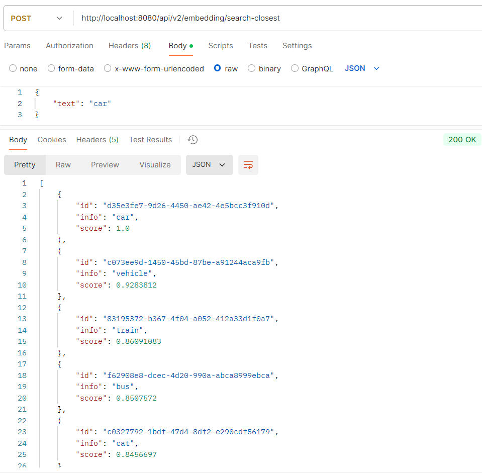

# MODULE 3 Work with different models. 
## Task 3. 

## Configuration parameters
### Environment variables:
```
AZURE_OPEN_AI_KEY = <AzureOpenAI API key>
AZURE_OPEN_AI_ENDPOINT = <AzureOpenAI API endpoint>
AZURE_OPEN_AI_DEPLOYMENT_NAME = <AzureOpenAI model name>
AZURE_OPEN_AI_EMBEDDINGS_DEPLOYMENT_NAME = <AzureOpenAI model name for embeddings>
AZURE_OPEN_AI_CHAT_TEMPERATURE = <AzureOpenAI default chat completions temperature (defailt 0.5)
QDRANT_HOST = <Qdrant server host (default localhost)>
QDRANT_PORT = <Qdrant server port (default 6334)>
QDRANT_COLLECTION_NAME = <Collection name on Qdrant server (default demo_collection)>
QDRANT_SEARCH_RESULT_LIMIT = <Limit of entries returned in search result (default 5)>
```
### Prompt execution settings for different deployments
JSON file [deployments-settings.json](src/main/resources/config/deployments-settings.json)
contains set of settings for several deployments.

### Search example

