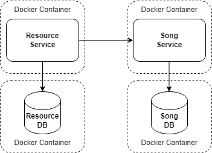

# Table of contents

- [What to do](#what-to-do)
- [Sub-task 1: Dockerfile](#sub-task-1-docker-images)
- [Sub-task 2: Docker Compose file](#sub-task-2-docker-compose-file)
- [Notes](#notes)

## What to do

In this module, you will adapt your services to use a containerization approach.

## Sub-task 1: Dockerfile

1. **Create a Dockerfile for each service**. Make sure to follow these requirements:

   - Implement **multi-stage builds** to create a clear separation between build and runtime environments, which helps keep the final image size small.
   - Use **Alpine images** to keep the resulting images lightweight (below are the recommended ones):
       - **Build Stage**:
           - For Maven projects, use [Eclipse Temurin-based Alpine images](https://hub.docker.com/_/maven/tags?name=eclipse-temurin-17-alpine). These allow you to build Java applications efficiently while keeping the environment minimal.
           - For Gradle projects, use [Gradle Alpine images](https://hub.docker.com/_/gradle/tags?name=jdk17-alpine), designed specifically for building Java applications with Gradle.
       - **Runtime Stage**:
           - Use [Eclipse Temurin Alpine images](https://hub.docker.com/_/eclipse-temurin/tags?name=17-jre-alpine) for running the application. These images include only the necessary JRE components, minimizing resource usage.
   - Introduce **dependency caching** to speed up rebuilds. This leverages Docker's layer caching to avoid re-downloading unchanged dependencies. **Tips**:
        - **For Maven projects**:
            - Copy the `pom.xml` file before copying the source code (`src`). This allows Docker to cache dependencies if the configuration file has not changed.
            - Use the command `RUN mvn dependency:go-offline` to download all dependencies before copying the source code.
        - **For Gradle projects**:
            - Copy the Gradle wrapper and build configuration files (`build.gradle`, `settings.gradle`, `gradlew`) first. This helps cache dependencies effectively.
            - Use the `--no-daemon` flag with `gradlew` to ensure consistent builds within Docker and manage memory usage effectively.


2. **Test the Docker images**

    - Build Docker images for each service.
    - Run the Docker containers and **map external ports** to verify that the application starts correctly and responds to HTTP requests (e.g., using Postman).


## Sub-task 2: Docker Compose file

### 1. Container configuration

Create a `docker-compose.yml` (`compose.yml`) file that includes the following elements:

- **Database containers**. Make sure to follow these requirements:

    - For each database, create a separate container using lightweight [Alpine-based PostgreSQL images](https://hub.docker.com/_/postgres/tags?name=17-alpine) (version 16 or higher).
    - Database-specific configurations, such as `POSTGRES_DB`, `POSTGRES_USER`, and `POSTGRES_PASSWORD`, should be read from the `.env` file.
    - Add `volumes` to mount initialization scripts and automate schema creation upon container startup. In doing so:
        - Disable automatic schema generation. For instance, if you are using `spring.jpa.hibernate.ddl-auto` in your `application.properties` or `application.yml`, set it to `none`.
        - Avoid using Flyway for initial schema setup in the Docker container, as the initialization scripts should handle this directly.
        - Avoid creating databases in the initialization scripts; these scripts should focus on setting up schemas, not on creating databases.
        - To automatically create the database when the container starts, specify the `POSTGRES_DB` environment variable.


- **Microservice containers**. Ensure you comply with these requirements:

    - For each service, add a block with the `build` parameter to build images directly from the source code using the Dockerfile located in each service’s subdirectory.
    - To avoid confusion, do not use both `build` and `image` together. The `image` property is intended to pull pre-built images from a registry (e.g., Docker Hub) or assume images are manually built.
    - Specify ports (`ports`) to expose for external access.
    - Define environment variables (`environment`), including database references, using an `.env` file for variable substitution.





### 2. Microservice configuration

Be sure to meet all these conditions:

   - Avoid hardcoding container-specific values (such as database URLs, credentials, service URLs, and any other configuration details specific to the containerized environment) directly in `application.properties` or `application.yml`.
   - Set container-specific values as environment variables in Docker Compose.
   - Use a `.env` file to define these variables, allowing Docker Compose to automatically read and inject environment-specific settings. For example:

       ```properties
       # .env
       RESOURCE_DB_URL=jdbc:postgresql://resource-db:5432/resource_db
       ```

       ```yaml
       # docker-compose.yml
       services:
         resource-service:
           environment:
             SPRING_DATASOURCE_URL: ${RESOURCE_DB_URL}
       ```

   - Configure `application.properties` or `application.yml` to support both environment variables for containerized execution and default values for local execution (e.g., when running directly in IntelliJ). For example::

     ```properties
     # application.properties for Resource Service
     spring.datasource.url="${SPRING_DATASOURCE_URL:jdbc:postgresql://localhost:5432/resource_db}"
     ```

   - Ensure the application can be executed both locally and in Docker Compose without requiring configuration changes or switching profiles:
       - **Local execution**: The application should use the default values specified in `application.properties` or `application.yml`. As in Module 1, only the databases need to run in containers, while the application itself should execute directly on the local machine.
       - **Docker execution**: Docker Compose should seamlessly pull configuration values from the `.env` file, enabling the containerized environment to use the necessary settings without manual adjustments.


### 3. Additional notes 

Adhere to the specified requirements:

   - Use Docker Compose's **default network**.
   - Use **logical service names** to cross-reference services for easier communication within the Docker network instead of IP addresses.
   - **Persisting database data** between restarts is not necessary.


## Notes

- Your configuration should automatically rebuild images, create, and start all containers, ensuring a complete service update without extra steps or scripts — all with a single command: `docker compose up -d --build`.
- Use the [Postman collection](../microservice_architecture_overview/api-tests/introduction_to_microservices.postman_collection.json) for testing the Resource Service and Song Service APIs.
- After all the changes, your project structure should look similar to this:

```
microservices/
├── init-scripts/
│   ├── resource-db/
│   │   └── init.sql
│   └── song-db/
│       └── init.sql
├── resource-service/
│   ├── src/
│   └── Dockerfile
├── song-service/
│   ├── src/
│   └── Dockerfile
├── docker-compose.yml
├── .env
└── .gitignore
```
