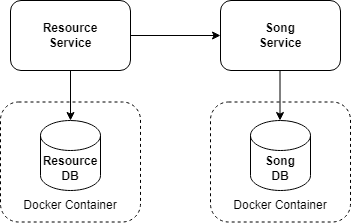

# Table of contents

- [What to do](#what-to-do)
- [Sub-task 1: Resource Service](#sub-task-1-resource-service)
- [Sub-task 2: Song Service](#sub-task-2-song-service)
- [Notes](#notes)

> Note: This is the updated version of the task. If you have already started working on [the previous version](README-deprecated.md), please continue with the previous one.

## What to do

Your task is to implement a microservices system consisting of two services:

- **Resource Service** - for MP3 file processing
- **Song Service** - for song metadata management

### Service relationships

The services have a one-to-one relationship, where:
- Song metadata uses the Resource ID as its primary key.
- Deleting a resource triggers the cascading deletion of its associated metadata.

### Requirements

- **Spring Boot** 3.0 or higher
- **Java** 17 or later (LTS versions)
- **Build Tool**: Maven or Gradle
- **Database**: PostgreSQL

## Sub-task 1: Resource Service

The Resource Service implements CRUD operations for processing MP3 files. When uploading an MP3 file, the service:

- Extracts file metadata (using external libraries like [Apache Tika](https://www.tutorialspoint.com/tika/tika_extracting_mp3_files.htm))
- Stores the MP3 file in the database
- Invokes the Song Service to save the MP3 file metadata

### API endpoints

---

#### 1. Upload resource

```
POST /resources
```

**Description:** Uploads a new MP3 resource.

**Request:**

- **Content-Type:** audio/mpeg
- **Body:** Binary MP3 audio data

**Response:**

```json
{
    "id": 1
}
```

- **Description:** Returns the ID of successfully created resource.

**Status codes:**

- **200 OK** – Resource uploaded successfully.
- **400 Bad Request** – The request body is invalid MP3.
- **500 Internal Server Error** – An error occurred on the server.

---

#### 2. Get resource

```
GET /resources/{id}
```

**Description:** Retrieves the binary audio data of a resource.

**Parameters:**

- `id` (Integer): The ID of the resource to retrieve.
- **Restriction:** Must be a valid ID of an existing resource.

**Response:**

- **Body:** Returns the audio bytes (MP3 file) for the specified resource.

**Status codes:**

- **200 OK** – Resource retrieved successfully.
- **404 Not Found** – Resource with the specified ID does not exist.
- **500 Internal Server Error** – An error occurred on the server.

---

#### 3. Delete resources

```
DELETE /resources?id=1,2
```

**Description:** Deletes specified resources by their IDs. If a resource does not exist, it is ignored without causing an error.

**Parameters:**

- `id` (String): Comma-separated list of resource IDs to remove.
- **Restriction:** CSV string length must be less than 200 characters.

**Response:**

```json
{
    "ids": [1, 2]
}
```

- **Description:** Returns an array of the IDs of successfully deleted resources.

**Status codes:**

- **200 OK** – Request successful, resources deleted as specified.
- **400 Bad Request** – CSV string format is invalid or exceeds length restrictions.
- **500 Internal Server Error** – An error occurred on the server.

---

## Sub-task 2: Song Service

The **Song Service** implements CRUD operations for managing song metadata records. The service uses the Resource ID as the primary key for metadata records, ensuring a direct one-to-one relationship between resources and their metadata.

---

### API endpoints

#### 1. Create song metadata

```
POST /songs
```

**Description:** Create a new song metadata record in the database.

**Request body:**

```json
{
    "id": "1",
    "name": "We are the champions",
    "artist": "Queen",
    "album": "News of the world",
    "duration": "02:59",
    "year": "1977"
}
```

- **Description:** Song metadata fields.

**Validation rules:**

- **All fields are required.**
- `id`: Numeric string, must match an existing Resource ID.
- `name`: 1-100 characters text.
- `artist`: 1-100 characters text.
- `album`: 1-100 characters text.
- `duration`: Format `mm:ss`, with leading zeros.
- `year`: `YYYY` format between 1900-2099.

**Response:**

```json
{
    "id": "1"
}
```

- **Description:** Returns the ID of the successfully created metadata record (should match the Resource ID).

**Status codes:**

- **200 OK** – Metadata created successfully.
- **400 Bad Request** – Song metadata is missing or contains errors.
- **409 Conflict** – Metadata for this ID already exists.
- **500 Internal Server Error** – An error occurred on the server.

---

#### 2. Get song metadata

```
GET /songs/{id}
```

**Description:** Get song metadata by ID.

**Parameters:**

- `id` (Integer): ID of the metadata to retrieve.
- **Restriction:** Must match an existing Resource ID.

**Response:**

```json
{
    "id": "1",
    "name": "We are the champions",
    "artist": "Queen",
    "album": "News of the world",
    "duration": "02:59",
    "year": "1977"
}
```

**Status codes:**

- **200 OK** – Metadata retrieved successfully.
- **404 Not Found** – Song metadata with the specified ID does not exist.
- **500 Internal Server Error** – An error occurred on the server.

---

#### 3. Delete songs metadata

```
DELETE /songs?id=1,2
```

**Description:** Deletes specified song metadata records by their IDs. If a metadata record does not exist, it is ignored without causing an error.

**Parameters:**

- `id` (String): Comma-separated list of metadata IDs to remove.
- **Restriction:** CSV string length must be less than 200 characters.

**Response:**

```json
{
    "ids": [1, 2]
}
```

- **Description:** Returns an array of the IDs of successfully deleted metadata records.

**Status codes:**

- **200 OK** – Request successful, metadata records deleted as specified.
- **400 Bad Request** – CSV string format is invalid or exceeds length restrictions.
- **500 Internal Server Error** – An error occurred on the server.

## Notes

### Error handling

Please add a global exception handler using `@RestControllerAdvice` and manage errors with a unified response structure:

#### Simple error response

```json
{
    "errorMessage": "Resource with ID=1 not found",
    "errorCode": "404"
}
```

#### Validation error response

```json
{
    "errorMessage": "Validation error",
    "details": {
        "duration": "Duration must be in the format MM:SS",
        "year": "Year must be in a YYYY format"
    },
    "errorCode": "400"
}
```

### Postman collection for testing

Please use the [Postman collection](./api-tests/introduction_to_microservices.postman_collection.json) for testing the Resource Service and Song Service APIs. Ensure that your services handle requests accurately and comply with the API specifications outlined in the documentation. This collection will help validate the correct functioning of all features and data validations.

### Database implementation requirements

- Use Docker containers for database deployment
- [PostgreSQL](https://hub.docker.com/_/postgres) 16+ is required as the database engine
- Each service should have its own dedicated database instance



### Structure

Both microservices represent a unified application and (will) use shared files. Please merge them into a single folder (Git repository), using the following folder structure as an example:

For a Maven-based project:

```
maven-project/
├── resource-service/
│   ├── src/
│   └── pom.xml
├── song-service/
│   ├── src/
│   └── pom.xml
└── .gitignore
```

For a Gradle-based project:

```
gradle-project/
├── resource-service/
│   ├── src/
│   └── build.gradle
├── song-service/
│   ├── src/
│   └── build.gradle
├── settings.gradle
└── .gitignore
```
