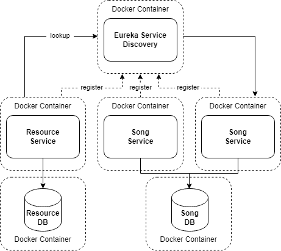

# Table of contents

- [What to do](#what-to-do)
- [Sub-task 1: Service registry](#sub-task-service-registry)
- [Sub-task 2: Prepare for final screening](#sub-task-prepare-for-final-screening)

## What to do

In this module, you need to integrate a service registry tool into your infrastructure.  
You can refer to a sample implementation using **Eureka** here: [Eureka Example](https://www.javainuse.com/spring/cloud-gateway-eureka).



Afterward, prepare for the final screening, where you may need to demonstrate the complete functionality of the application with the integrated service registry.

## Sub-task 1: Service registry

1) Use the Eureka Service Registry for [Service Registration and Discovery](https://spring.io/guides/gs/service-registration-and-discovery/).


2) Ensure that all microservices act as Eureka clients and register with the Eureka server (which includes both the Load Balancer and Service Registry).


3) Ensure the application runs seamlessly both locally and in Docker Compose by using default values in `application.properties` or `application.yml` for local execution and pulling settings from the `.env` file via Docker Compose for Docker execution.


## Sub-task 2: Prepare for final screening

1) Prepare an archive of the final version of your project or provide a link to it in a public repository. This should be shared **directly with your mentor upon request** (there’s no need to upload it to Avalia this time).


2) Prepare for a demo where you will demonstrate the functionality of the entire application, including all major features and use cases, as specified in the task. During this final screening, you should:

    - Stop any running containers to ensure a clean start:
      ```bash
      $ docker compose down
      ```

    - Start the containers with the following command, which builds the images and scales the Song Service to 2 instances:
      ```bash
      $ docker compose up -d --build --scale song-service=2
      ```
      **Note**: Instead of using `--scale song-service=2`, you can add the following configuration to your Compose file to set the number of replicas by default:
      ```yaml
      song-service:
        deploy:
          replicas: 2
      ```

    - List the running containers:
      ```bash
      $ docker ps
      ```

    - Show logs for Resource Service and Song Service:
      ```bash
      $ docker compose logs -f resource-service song-service
      ```

    - Display the Spring Eureka web interface in a browser to show the registered instances (1 instance of RESOURCE-SERVICE and 2 instances of SONG-SERVICE). Ensure that the applications are running in Docker.

    - Perform the following requests (using Postman or another tool):

        1. **Happy path**:
            - **POST** to `/resources` (upload an MP3 file, with `Content-Type` "audio/mpeg"; verify successful response with an ID).
            - **GET** `/resources/{id}` (returns the MP3 file; verify `Content-Type` "audio/mpeg" and playback).
            - **GET** `/songs/{id}` (returns metadata of the MP3 file; verify fields: name, artist, album, etc.).
            - **DELETE** `/resources?id={id}` (deletes the MP3 file and returns list of deleted IDs).
            - **GET** `/resources/{id}` (verify resource is deleted - expect 404).
            - **GET** `/songs/{id}` (confirm metadata is deleted - expect 404).

        2. **Error cases for Resource Service**:
            - **POST** to `/resources` (send invalid non-MP3 data - expect 400).
            - **GET** `/resources/99999` (non-existent ID - expect 404).
            - **GET** `/resources/ABC` (ID with letters - expect 400).
            - **GET** `/resources/1.1` (decimal ID - expect 400).
            - **GET** `/resources/-1` (negative ID - expect 400).
            - **GET** `/resources/0` (zero ID - expect 400).
            - **DELETE** `/resources?id=1,2,3,4,V` (CSV with letters - expect 400).
            - **DELETE** `/resources?id=1,2,3,...` (CSV longer than 200 chars - expect 400).

        3. **Error cases for Song Service**:
            - **POST** to `/songs` (invalid duration "02:77" and year "01977" - expect 400).
            - **POST** to `/songs` (missing required fields: name, artist - expect 400).
            - **POST** to `/songs` (duplicate song metadata with the same ID - expect 409).
            - **GET** `/songs/99999` (non-existent ID - expect 404).
            - **DELETE** `/songs?id=1,2,3,4,V` (CSV with letters - expect 400).
            - **DELETE** `/songs?id=1,2,3,...` (CSV longer than 200 chars - expect 400).

    - Ensure that you return informative error messages to the client. For example:

      Simple error response:
      ```json
      {
          "errorMessage": "Resource with ID=1 not found",
          "errorCode": "404"
      }
      ```

      Validation error response:
      ```json
      {
          "errorMessage": "Validation error",
          "details": {
              "duration": "Duration must be in the format MM:SS",
              "year": "Year must be in YYYY format"
          },
          "errorCode": "400"
      }
      ```

   **Note**: Please consider using [this Postman collection](../microservice_architecture_overview/api-tests/introduction_to_microservices.postman_collection.json) for the demo.

