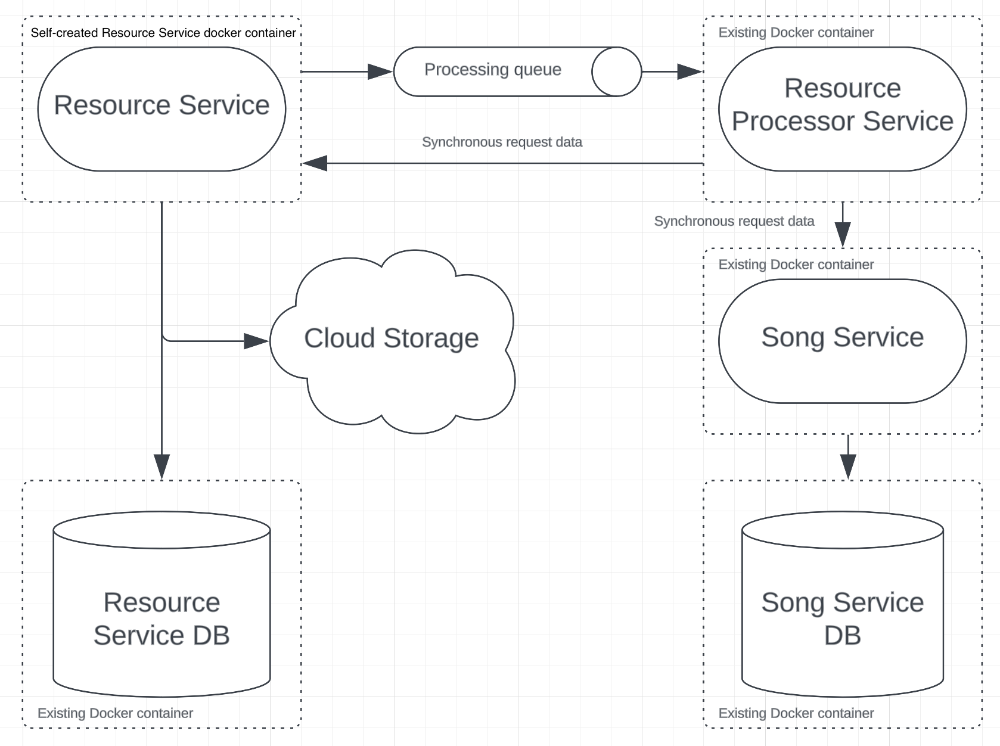

# Table of Content

- [What to do](#what-to-do)
- [Sub-task 1: Resource processor](#sub-task-1-resource-processor)
- [Sub-task 2: Asynchronous communication](#sub-task-2-asynchronous-communication)

## What to do

In this module it is needed to adjust **Resource Service** created in the previous modules with adding cross-servers
calls.

<div align="center">
    
</div>

## Sub-task 1: Resource Processor

The **Resource Processor** provides the ability to retrieve metadata from mp3 file and post it into **Song Service**.
The service could be run from existing docker [image](https://hub.docker.com/r/stky20/resource-processor-image/tags)
that configured to listen [RabbitMQ](https://www.rabbitmq.com/) queue.
Provided **Resource Processor** downloads resource by resourceId from **Resource Service** implemented by mentee.
Be sure that **Resource Service** API is running and available via http.

If you prefer to use a different messaging broker, you can configure the **Resource Processor** on your own with
provided:

1. Java [source code](https://repo).

To run **Resource Processor** as a docker container follow next steps:

- Update the docker-compose.yml file with the following content:

```
services:
  song-ms:
    image: stky20/song-ms-image
    ports:
      - {SONG_MS_PORT}:8081
    environment:
      - db_url=song-ms-db
    restart: always
    depends_on:
      - song-ms-db
        
  song-ms-db:
    image: postgres
    volumes:
      - song-ms-db-data:/var/lib/postgresql/data
    environment:
      - POSTGRES_DB=postgres
      - POSTGRES_PASSWORD=postgres
    ports:
      - {SONG_MS_DB_PORT}:5432
    restart: always
    
  resource-processor-ms:
    image: stky20/resource-processor-ms-image
    ports:
      - {RESOURCE_PROCESSOR_MS_PORT}:8082
    restart: always
    environment:
      - RABBITMQ_URL=rabbitmq
      - RABBITMQ_QUEUE={RABBITMQ_QUEUE}
      - RESOURCE_MS_URL={RESOURCE_MS_URL}
      - SONG_MS_URL={SONG_MS_URL}
    depends_on:
      - rabbitmq
      - song-ms
      - {RESOURCE_SERVICE_MS}
    
  rabbitmq:
    image: rabbitmq:3.10.7-management
    volumes:
      - rabbit-mq:/var/lib/rabbitmq
    environment:
      - RABBITMQ_DEFAULT_USER={RMQ_USER}
      - RABBITMQ_DEFAULT_PASS={RMQ_PASSWORD}
    restart: always
    ports:
      - 15672:15672
      - 5672:5672

volumes:
  song-ms-db-data:
  rabbit-mq:
```

- Replace the following placeholders to appropriate values:\
  **SONG_MS_PORT** - local machine port on which **Song Service** will be run.\
  **SONG_MS_DB_PORT** - local machine port on which **Song Service Postgres DB** will be run.\
  **RESOURCE_MS_URL** - local machine url and port on which **Resource Service** will be run.\
  **SONG_MS_URL** - local machine url and port on which **Song Service** will be run.\
  **RESOURCE_SERVICE_MS** - the name of **Resource Service** which declared in this docker compose file.\
  **RMQ_USER** - user name for **Rabbit MQ**.\
  **RMQ_PASSWORD** - user password for **Rabbit MQ**.
  **RABBITMQ_QUEUE** - queue name for communication between **Resource Service** and **Resource Processor**.

## Sub-task 2: Asynchronous communication

1) Remove all http calls to **Song Service** from **Resource Service** implemented in previous modules
2) Add asynchronous communication via messaging broker between **Resource Service** and **Resource Processor**.
3) On resource uploading, **Resource Service** should send information about uploaded resource to the **Resource
   Processor**, which contains “resourceId”.

**Note**

For this module you could
use [Rabbit MQ](https://hub.docker.com/_/rabbitmq), [ActiveMQ](https://hub.docker.com/r/rmohr/activemq) or any other
broker for asynchronous communication (it’s better to discuss with expert).

