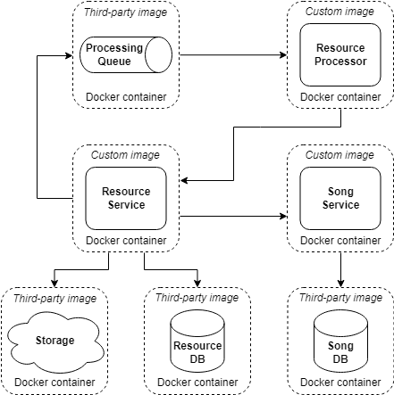

# Table of Content

 - [What to do](#what-to-do)
 - [Sub-task 1: Docker images](#sub-task-1-docker-images)
 - [Sub-task 2: Docker Compose file](#sub-task-2-docker-compose-file)

## What to do

In this module you will need to adjust your services with containerization approach.

## Sub-task 1: Docker images

1) Package your applications as Docker images.
2) For each of your services:
 - Create a new or modify an existing _Docker_ file that will contain instructions for packaging your project.
 - Build a docker image and run it, mapping an external port to verify that application can be started and respond to requests.

## Sub-task 2: Docker Compose file

1) When all applications are successfully packaged, create a new or modify an existing _docker-compose.yml_ file that would list all applications and 3rd party dependencies to successfully start the project.
Add init scripts for the database to run when container starts up. Once you have a compose file, you can create and start your application containers with a single command: `docker-compose up`.

Please note the following:
 - Use an _.env_ file to replace all environment variables depending on the set-up.
 - For 3rd party dependencies try to use the _–alpine_ images whenever it's possible.
 - For project applications use the build property as these images are not going to be pulled from a public hub.
 - Use logical service names to cross-reference services.

Possible container options for existing resources:

 - [postgres DB](https://hub.docker.com/_/postgres)
 - [mysql db](https://hub.docker.com/_/mysql)
 - [RabbitMQ message broker](https://hub.docker.com/_/rabbitmq)
 - [ActiveMQ message broker](https://hub.docker.com/r/rmohr/activemq)
 - [Local stack (aws emulator)](https://hub.docker.com/r/localstack/localstack)

