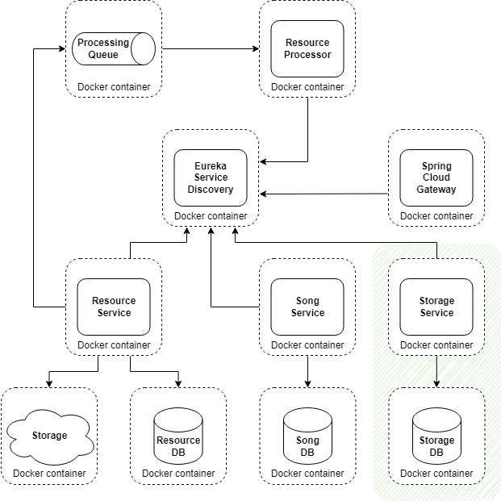
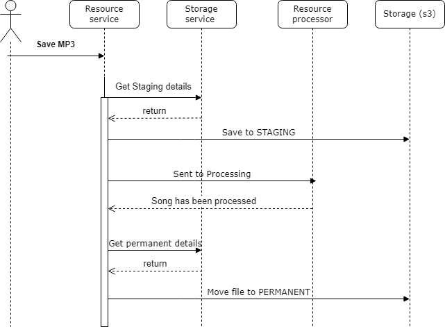

# Table of Content

 - [What to do](#what-to-do)
 - [Sub-task 1: Implement Storage Service](#sub-task-1-implement-storage-service)
 - [Sub-task 2: Implement Circuit Breaker](#sub-task-2-implement-circuit-breaker)

## What to do

There are a few options for implementing a circuit breaker in microservices communications.

The current implementation from the previous tasks does not include any near-static data, so to emulate a stubbed circuit breaker, we need to add an element that simulates this data.
1. Now our files can be in different states depending on the processing phase: STAGING - file in processing, PERMANENT - file has been successfully processed.
2. To store and manage these states, we will create a Storage Service. The Resource Service will query the Storage Service for state details.
3. In case the Storage service is unavailable, we will extend the Resource Service to use the advantages of a fault tolerance pattern.

## Sub-task 1: Implement Storage Service

1) Create and implement a new independent microservice with a CRUD API representing the Storage concept. The service will be used for the management of **storage** types. 
   Prior to this task, the **Resource Service** used its own configuration to access data stores (**s3 buckets**). Now this configuration will be moved to the new service. 
   When the **Storage Service** starts, at least two different storage types (**Storage object**) should be created in the database by default, which will be used by the **Resource Service**. The same storage buckets should be created in **localstack**. 
   A **Storage object** can have only the following **storageType** values: **STAGING** or **PERMANENT**. One for **permanent** storage, another for **staging**. They should have different bucket paths. Other storages can also be added via the Storage Service API.

<table>
    <tr>
        <td><b>POST /storages</b></td>
        <td colspan="6"><i>Create new storage</i></td>
    </tr>
    <tr>
        <td rowspan="2"><b>Request</b></td>
        <td>Parameter</td>
        <td>Description</td>
        <td>Restriction</td>
        <td>Body example</td>
        <td>Description</td>
        <td>Restriction</td>
    </tr>
    <tr>
        <td></td>
        <td></td>
        <td></td>
        <td>{ &nbsp;&nbsp;&nbsp;&nbsp;"storageType": "PERMANENT", &nbsp;&nbsp;&nbsp;&nbsp;"bucket": "bucket_name", &nbsp;&nbsp;&nbsp;&nbsp;"path": "/files" }</td>
        <td>Content type – application/json  Data representing a particular storage place or space for binary data</td>
        <td></td>
    </tr>
    <tr>
        <td rowspan="2"><b>Response</b></td>
        <td colspan="2">Body</td>
        <td colspan="2">Description</td>
        <td colspan="2">Code</td>
    </tr>
    <tr>
        <td colspan="2">{ &nbsp;&nbsp;&nbsp;&nbsp;"id":1123 }</td>
        <td colspan="2">Integer id – ID of the created storage</td>
        <td colspan="2">200 – OK 400 – Validation error 500 – Internal server error occurred.
        </td>
    </tr>
    <tr>
        <td><b>GET /storages</b></td>
        <td colspan="6"><i>Get storage list</i></td>
    </tr>
    <tr>
        <td rowspan="2"><b>Request</b></td>
        <td>Parameter</td>
        <td>Description</td>
        <td>Restriction</td>
        <td>Body example</td>
        <td>Description</td>
        <td>Restriction</td>
    </tr>
    <tr>
        <td></td>
        <td></td>
        <td></td>
        <td></td>
        <td></td>
        <td></td>
    </tr>
    <tr>
        <td rowspan="2"><b>Response</b></td>
        <td colspan="3">Body</td>
        <td>Description</td>
        <td colspan="2">Code</td>
    </tr>
    <tr>
        <td colspan="3">[{ "id": "1", &nbsp;&nbsp;&nbsp;&nbsp;"storageType": "PERMANENT", &nbsp;&nbsp;&nbsp;&nbsp;"bucket": "bucket_name", &nbsp;&nbsp;&nbsp;&nbsp;"path": "/files" }]</td>
        <td>List of existing storages</td>
        <td colspan="2">200 – OK 500 – Internal server error occurred</td>
    </tr>
    <tr>
        <td><b>DELETE /storages?id=1,2</b></td>
        <td colspan="6"><i>Delete storages by given IDs (if a storage ID is not present, do nothing)</i></td>
    </tr>
    <tr>
        <td rowspan="2"><b>Request</b></td>
        <td>Parameter</td>
        <td>Description</td>
        <td>Restriction</td>
        <td>Body example</td>
        <td>Description</td>
        <td>Restriction</td>
    </tr>
    <tr>
        <td>String id</td>
        <td>CSV of storage IDs to delete</td>
        <td>A valid CSV length is less than 200 characters</td>
        <td></td>
        <td></td>
        <td></td>
    </tr>
    <tr>
        <td rowspan="2"><b>Response</b></td>
        <td colspan="3">Body</td>
        <td>Description</td>
        <td colspan="2">Code</td>
    </tr>
    <tr>
        <td colspan="3">{ &nbsp;&nbsp;&nbsp;&nbsp;"ids": [1,2] }</td>
        <td>Integer [] ids – IDs of deleted storages</td>
        <td colspan="2">200 – OK 500 – Internal server error occurred.</td>
    </tr>
</table>

! Please note that in the local database, we store general information about storage types, not about the state of each file.

2) Update system to interact with the new **Storage Service**: 
   Depending on the file processing state, we will store it in different locations (different paths/folders for files). To find out details about each state and the appropriate storage path, we will call the **Storage Service**. 
   When a new file comes to the **Resource Service** for processing, we save the file to **STAGING** storage, update the file state and path in the local DB, then send the file for further processing. 
   When the **Resource Service** receives a signal from the **Resource Processor** that the file has been successfully processed, we change the state of the file to **PERMANENT** and update the link in the **Resource Service** local DB. 
   The diagrams below will help you understand what we are talking about.

**Note**: You can add more file states depending on your system's needs, but let's start with two to decrease system complexity.

## Sub-task 2: Implement Circuit Breaker

Finally, we implement the circuit breaker pattern.
Imagine that the Storage Service is down, but we do not want to make our users wait until we repair services.
So for such cases, when the Storage Service is unavailable, we will store stub data in the Resource Service to emulate the response from the Storage Service.
The emulated response should be the same as what the storage service would return.

1) Add the [Resilience4j](https://mvnrepository.com/artifact/io.github.resilience4j/resilience4j-circuitbreaker) library to the **Resource Service**.
2) Add the circuit breaker config to services (when calling **Storage Service** to get storages for storing processed files).
3) When an exception is returned from the called service, provide a stub result.
4) Simulate a failure of the service by shutting down a called service (**Storage Service**) and test the circuit breaker.
