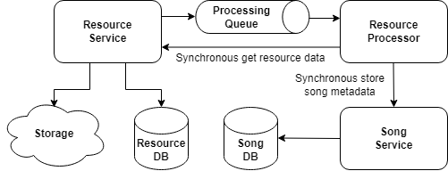

# Table of Content

- [What to do](#what-to-do)
- [Sub-task 1: Asynchronous communication](#sub-task-1-asynchronous-communication)
- [Sub-task 2: Events handling](#sub-task-2-events-handling)
- [Sub-task 3: Retry mechanism](#sub-task-3-retry-mechanism)

## What to do

In this module it is needed to adjust services created in the first module with adding cross-servers calls.

## Sub-task 1: Asynchronous communication

1) Add asynchronous communication via messaging broker between **Resource Service** and **Resource Processor**. 
2) On resource uploading, **Resource Service** should send information about uploaded resource to the **Resource Processor**, which contains “resourceId”.

[Rabbit MQ](https://hub.docker.com/_/rabbitmq), [ActiveMQ](https://hub.docker.com/r/rmohr/activemq) or any other broker usage is possible.

## Sub-task 2: Events handling

1) When the **Resource Processor** has an event of receiving message, it uses a synchronous call to get the resource data (binary) from the **Resource Service**, parses the metadata, and uses the synchronous call to save the metadata of the song in the **Song. Service**.
2) Need to implement some way of queue listening/subscription. For example, [Rabbit Spring Streams](https://docs.spring.io/spring-cloud-stream-binder-rabbit/docs/current/reference/html/spring-cloud-stream-binder-rabbit.html).

## Sub-task 3: Retry mechanism

While implementing communications between services it’s necessary to think about implementation of **Retry Mechanism**, e.g: [Retry Pattern](https://docs.microsoft.com/en-us/azure/architecture/patterns/retry).
Implementation can be based on the [Spring Retry Template](https://docs.spring.io/spring-batch/docs/current/reference/html/retry.html) or annotations for both synchronous and asynchronous communication.

**Note**

For this module you could use any of the messaging brokers for asynchronous communication (it’s better to discuss with expert).

