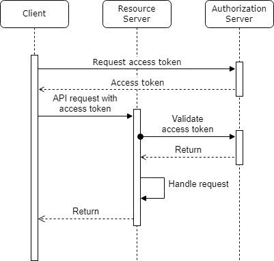

# Table of Content

 - [What to do](#what-to-do)
 - [Sub-task 1: Security](#sub-task-1-security)
 - [Sub-task 2: UI Application (Optional)](#sub-task-2-ui-application-optional)
 - [Useful links](#useful-links)

## What to do

In this task it is needed to implement oAuth for microservice.
Pick with mentor better option: Do it with the help of external Auth provider or use Spring authorization server.

## Sub-task 1: Security

1) Use two roles for implementation: Admin and User. 
2) Protect **Storage API** post and delete methods with Admin access only using JWT token. 
3) For supporting use any existing free Auth provider or create own provider with spring authorization server or Keycloak. 
4) Create JWT token verification mechanism if it is required. 
5) Check and verify access to API using [Postman](https://www.postman.com/downloads/) or other client tools.

## Sub-task 2: UI Application (Optional)

1) Create a simple UI application with storage form and table of storages. 
2) Integrate it with Auth provider.

## Useful links

**Spring Authorization server:**
 - [Spring authorization server sample](https://www.baeldung.com/spring-security-oauth-auth-server)

**Keycloak samples:**
 - [A Quick Guide to Using Keycloak with Spring Boot](https://www.baeldung.com/spring-boot-keycloak)
 - [Secure Spring Boot Application With Keycloak](https://dzone.com/articles/secure-spring-boot-application-with-keycloak)
 - [Securing Spring Boot REST APIs with Keycloak](https://medium.com/devops-dudes/securing-spring-boot-rest-apis-with-keycloak-1d760b2004e)

**General:**
 - [The OAuth 2.0 Authorization Framework specification](https://datatracker.ietf.org/doc/html/rfc6749)
 - [OAuth2 Boot Implementation example](https://docs.spring.io/spring-security-oauth2-boot/docs/current/reference/html5/)